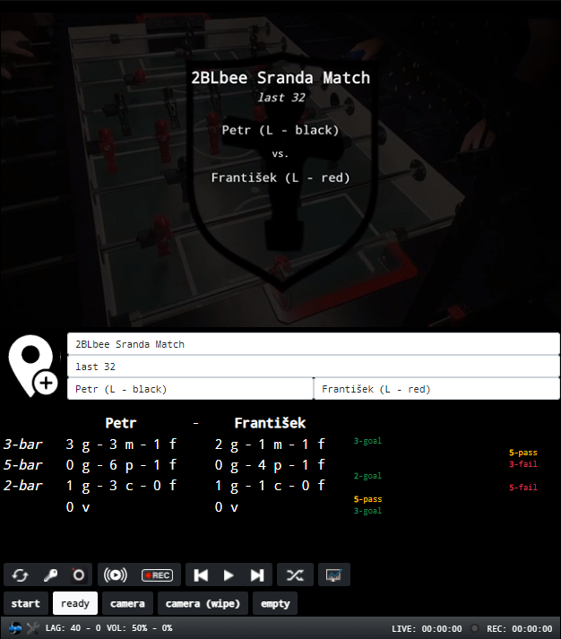

StreamBalls
===========

StreamBalls project is a web-based application, that connects to OBS (via [obs-websocket](https://obsproject.com/forum/resources/obs-websocket-remote-control-obs-studio-from-websockets.466/)) and allows standard user actions to be carried out remotely. Live preview of OBS output (with latency < 1s) provides feedback to the live stream content.

Preview screen is also a tool, that enables some further user actions, such as generating statistics when streaming sports. The interface allows input of some basic match info (competition name, round, player names) that can be displayed in OBS via browser source. Match statistics can be also displayed the same way.  

The project is based on [meteor-js](https://www.meteor.com) and [react](https://reactjs.org). Meteor was chosen due to it's real-time nature. Any update done in StreamBalls interface is immediately (via websocket) projected into all connected clients, so that content of mentioned OBS browser sources is updated without delay.

Live preview uses OBS low latency NDI output ([obs-ndi](https://obsproject.com/forum/resources/obs-ndi-newtek-ndi™-integration-into-obs-studio.528/)), ffmpeg with built-in NDI I/O support as preview stream encoder, and WebRTC ([mediasoup](https://mediasoup.org)) to deliver output (both audio and video) to the browser. When camera also uses NDI (e.g. [OBS camera](https://obs.camera) or [NDI HX](https://play.google.com/store/apps/details?id=com.newtek.ndi.hxcam&hl=de&gl=US)) then glass-to-glass delay (camera to browser) is 500ms.

### Available OBS actions
- start / stop streaming / recording
- change OBS scene
- change streaming key
- start / pause / next / previous in background audio (VLC source)
- audio volume crossfade between main camera and background audio
- toggle match info and statistics page visibility (in scenes where configured)
- reset OBS to default state before streaming starts

### Other interface actions
- create new match
- live update of player / team names, competition name and round
- live input of game events (so far for foosball singles)
- remote reset of main camera source
- remote reset of preview encoder

The project code is released under BSD-3-Clause license. The required ffmpeg encoder must have NewTek NDI I/O support enabled, which makes the executable no longer distributable and therefore it is not included in this project. The process to compile such build is described in [ffmpeg how-to](doc/ffmpeg.md). The project has been tested under Windows 10 with Visual Studio 2017 and all documentation describes usage in Windows.

## Overview

In the typical use-case a single camera or smartphone, dual band router, PC dedicated to running OBS together with StreamBalls application and laptop or tablet connected to StreamBalls application are used.

### 1. Camera

Any smartphone can be used as a camera for streaming purposes. For iOS devices the [OBS camera](https://obs.camera) is highly recommended, because it allows to adjust many HW features of camera, such as exposure time, focus lock and white balance and it also allows user to select exactly the resolution and framerate of stream passed to OBS. [Epoccam](https://www.elgato.com/de/epoccam) is a NDI-capable alternative, however compared to OBS camera it has very limited features. For Android devices the only alternative is [NDI HX](https://play.google.com/store/apps/details?id=com.newtek.ndi.hxcam&hl=de&gl=US), but it does not allow HW features of camera to be adjusted. [iVCam](https://www.e2esoft.com/ivcam/) is a free alternative, but I wouldn't recommend that, because it uses lossy compression and adds extra latency. The [IP Webcam](https://play.google.com/store/apps/details?id=com.pas.webcam&hl=de&gl=US) with rtsp can be used for testing purposes, but do not expect any high quality from the result.

Camera can be connected to network via wifi and in that case it is suitable to dedicate 5GHz band just for this purpose. [Standard HD](https://en.wikipedia.org/wiki/720p) with 30 fps uses 100 Mbits/s when transferred via lossless NDI. With router capable of [802.11ac](https://en.wikipedia.org/wiki/IEEE_802.11ac-2013#Advertised_speeds) it is possible to connect up to 10 cameras with HD quality using lossless NDI. In case the router or camera does not support 5GHz connectivity then it can be connected to PC via USB and achieve the same thing, however using cables is nothing but pain.

In general there are many alternative ways to connect moreless any device to PC and make it media source in OBS and I'm not going to list them here. It can be really challenging to figure out the optional way. Please keep in mind that when streaming from smartphone you dont want someone to call you in the middle of a stream, you want to disable messenger and so on.

### 2. Streaming PC

The PC used to run OBS and StreamBalls application does not need to be some cutting-edge hardware. Lag-free streaming in [Standard HD](https://en.wikipedia.org/wiki/720p) is tested with [IdeaPad U430](https://www.cnet.com/products/lenovo-u430-touch-14-core-i7-4500u-4-gb-ram-500-gb-hybrid-drive/) running Windows 8. It is recommended to connect this PC to network via ethernet cable and configure QoS on router to reserve enough upload bandwidth for streaming. It is also a good idea to reserve static IP or assign hostname to this machine to make life easier when connecting to it from other device. StreamBalls and FFmpeg can be built on different hardware and the result can be just copied here, so there is no need to install Visual Studio, Meteor and other tools needed just for development or build purposes. It should only be enough to install and configure [OBS](https://obsproject.com) and install [nodejs](https://nodejs.org/en/download/) and [mongodb](https://www.mongodb.com/try/download/community), set firewall rules and copy ffmpeg and application bundle here. As a result when OBS is started on this machine all further actions should be handled remotely, however it is not a problem to connect to StreamBalls from here, it's only impractical.

### 3. Remote Control

Any device capable of running web browser can be used to connect to StreamBalls application. It only has to be on the same local network or some sort of VPN has to be configured. This device uses no more than 250 KB/s download bandwidth from Streaming PC (when live preview is running), so the stream can be easily controlled from anywhere. StreamBalls is not designed to be responsive, but it can be easily customized to fit any sophisticated needs. Anyway out of the box the low latency preview, switching scenes, starting / stopping of live stream / recording and some basic status info should work on any device that is able to run web browser.   

## Installation

For the sake of simplicity I'll assume that the build of all needed stuff shall be done on the same machine, where the result shall be deployed. First of all follow steps described in [ffmpeg how-to](doc/ffmpeg.md) to have FFmpeg with NDI IO support in PATH. When this is done, we can assume that both git and Visual Studio needed to build some components of StreamBalls (e.g. mediasoup or grandiose) are present. Now install [nodejs](https://nodejs.org/en/download/) and then Meteor by running the following command from cmd

    npm install -g meteor

Clone StreamBalls repository if you haven't done that already by running

    git clone https://github.com/mutant-industries/StreamBalls.git <streamballs_repository_root>

Now prepare prerequisites to build mediasoup as described in installation [how-to](https://mediasoup.org/documentation/v3/mediasoup/installation/#windows) for Windows. Then change directory to <streamballs_repository_root> and run 

    npm install

Now have some patience, it might take quite long time before the application is built. Proceed with basic setup of OBS as described in [OBS how-to](doc/obs.md). When done start OBS and try to run StreamBalls in development mode by simply executing

    meteor

This is how the typical output should look like

    [[[[[ ~\D\stream\streamballs ]]]]]
    
    => Started proxy.
    => Started HMR server.
    => Started MongoDB.
    => Started your app.
    
    => App running at: http://localhost:3000/
    Type Control-C twice to stop.
    
    I20210915-16:13:59.113(2)? calling ffmpegServiceReset
    I20210915-16:14:00.239(2)? client connected: sPcdkFr386tCsiGnd
    I20210915-16:14:00.262(2)? client connected: rJRJA84SQtLouXQxJ
    I20210915-16:14:05.590(2)? ffmpeg source: { name: 'KITCHEN_PC (OBS)', urlAddress: '192.168.61.241:5961' } PID: 144
    I20210915-16:14:09.503(2)? Guessed Channel Layout for Input Stream #0.0 : stereo
    I20210915-16:14:09.504(2)? Input #0, libndi_newtek, from 'MD1UMUTC (OBS)':
    I20210915-16:14:09.504(2)?   Duration: N/A, start:
    I20210915-16:14:09.504(2)? 4094.413758, bitrate: 443904 kb/s
    I20210915-16:14:09.505(2)?   Stream #0:0: Audio: pcm_s16le, 48000 Hz, stereo, s16, 1536 kb/s
    I20210915-16:14:09.505(2)?   Stream #0:1: Video: rawvideo (UYVY / 0x59565955), uyvy422(progressive), 1280x720 [SAR 1:1 DAR 16:9], 442368 kb/s, 30 fps, 30 tbr, 10000k tbn
    I20210915-16:14:09.506(2)? Stream mapping:
    I20210915-16:14:09.506(2)?   Stream #0:0 -> #0:0 (pcm_s16le (native) -> opus (libopus))
    I20210915-16:14:09.506(2)?   Stream #0:1 -> #0:1 (rawvideo (native) -> h264 (h264_qsv))
    I20210915-16:14:09.507(2)? Press [q] to stop, [?] for help
    I20210915-16:14:09.646(2)? Output #0, tee, to '[select=a:f=rtp:ssrc=1111:payload_type=97]rtp://127.0.0.1:10035?rtcpport=10081|[select=v:f=rtp:ssrc=2222:payload_type=96]rtp://127.0.0.1:10097?rtcpport=10003':
    I20210915-16:14:09.646(2)?   Metadata:
    I20210915-16:14:09.647(2)?     encoder         : Lavf59.4.101
    I20210915-16:14:09.647(2)?   Stream #0:0: Audio: opus, 48000 Hz, stereo, s16, 12 kb/s
    I20210915-16:14:09.648(2)?     Metadata:
    I20210915-16:14:09.648(2)?       encoder         : Lavc59.4.100 libopus
    I20210915-16:14:09.648(2)?   Stream #0:1: Video: h264, nv12(progressive), 640x360 [SAR 1:1 DAR 16:9], q=2-31, 1400 kb/s, 30 fps, 30 tbn
    I20210915-16:14:09.649(2)?     Metadata:
    I20210915-16:14:09.649(2)?       encoder         : Lavc59.4.100 h264_qsv
    I20210915-16:14:09.649(2)?     Side data:
    I20210915-16:14:09.650(2)?       cpb: bitrate max/min/avg: 1400000/1400000/1400000 buffer size: 50 vbv_delay: N/A

If you open [http://localhost:3000/](http://localhost:3000/) in browser now, the application should be running. Click on the reset button (the one on the left, next to the key button). You can try to connect to StreamBalls from some different device on your local network. To see the output preview you'll have to create another inbound rule to allow mediasoup executable (<streamballs_repository_root>\node_modules\mediasoup\worker\out\Release\mediasoup-worker.exe) accept connections in [firewall](http://lexisnexis.custhelp.com/app/answers/answer_view/a_id/1081611/~/adding-exceptions-to-the-windows-firewall). If you still have problems with preview screen you can try to enable [media streaming](https://www.isunshare.com/windows-10/turn-on-or-off-media-streaming-in-windows-10.html). Congratulations if you made it this far and everything works.

## Deployment

Running meteor application in development mode on production environment makes no sense, because it uses a lot of extra resources. The next problem is when starting OBS the StreamBalls application has to be started separately, which makes it very impractical. Let's start with installation of [mongodb](https://www.mongodb.com/try/download/community). Then let's use following script to create production version of StreamBalls

    @echo off
    
    set PROJECT_ROOT=d:\stream
    set STREAMBALLS_REPOSITORY_ROOT=%PROJECT_ROOT%\streamballs

    rem remove any existing build
    rd /s /q "%PROJECT_ROOT%\bundle"
    rem remove any existing temporary files
    rd /s /q "%PROJECT_ROOT%\temp"
    
    rem create temporary directory for deployment
    md "%PROJECT_ROOT%\temp"
    md "%PROJECT_ROOT%\temp\.git"
    
    rem copy .git folder from StreamBalls project
    Xcopy /E /I /S /H "%STREAMBALLS_REPOSITORY_ROOT%\.git" "%PROJECT_ROOT%\temp\.git"
    
    cd /D "%PROJECT_ROOT%\temp"
    
    rem reset to latest revision
    git reset --hard
    
    rem install npm dependencies for production
    call npm install --production
    
    rem build application for production (https://github.com/meteor/meteor/issues/6270)
    call meteor build --server-only --allow-superuser --architecture os.windows.x86_64 --directory "%PROJECT_ROOT%"
    
    rem install npm dependencies
    cd /D "%PROJECT_ROOT%\bundle\programs\server"
    call npm install
    
    rem delete temp directory
    rd /s /q "%PROJECT_ROOT%\temp"

This shall take a while and once finished we can test it by running this code

    set APPLICATION_BUNDLE_ROOT=%PROJECT_ROOT%\bundle
    set MONGO_URL=mongodb://localhost:27017/streamballs
    set ROOT_URL=http://localhost
    set PORT=3000
    set NODE_ENV=production

    cd /D %APPLICATION_BUNDLE_ROOT%

    node main.js

Open [http://localhost:3000/](http://localhost:3000/) once again to test that application runs. If you can't see browser sources don't panic, just reset OBS to default state by clicking reset button. You'll want to set another inbound rule to allow mediasoup executable (<application_bundle_root>\programs\server\npm\node_modules\mediasoup\worker\out\Release\mediasoup-worker.exe) accept connections in [firewall](http://lexisnexis.custhelp.com/app/answers/answer_view/a_id/1081611/~/adding-exceptions-to-the-windows-firewall).

The last thing is to make StreamBalls start automatically when OBS is started. Download and install python 3.6.4. Honestly, get exactly this version, it's the only one that works and it is almost impossible to figure out what is wrong, when you install something else. In OBS open tools -> scripts -> Python Settings and enter the path where your new python is located. Edit variables in [autostart.py](autostart.py) to fit your needs, switch back to Scripts and add the autostart script here. Now Streamballs magically runs whenever OBS runs so that you don't have to mess around with console anymore. 
