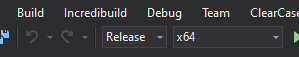

FFmpeg with NewTek NDI I/O support
===========

There are many options how to display OBS output in web browser, however when it is required to be low latency then the number of options becomes rather limited. 
In browser the only option is to use WebRTC. In OBS again the only option seems to be NDI output (via [obs-ndi](https://obsproject.com/forum/resources/obs-ndi-newtek-ndi™-integration-into-obs-studio.528/) plugin).
This is lossless output, that is not delayed by streaming or recording encoder, so the latency is ultra-low and no CPU is wasted.
Maybe some combination of DirectShow output (with OBS virtual camera) and [virtual cables](https://jshingler.github.io/blog/2021/01/31/obs-virtual-cables/)
might also do the trick, but probably we'll have to wait until OBS virtual cam [shall carry sound](https://ideas.obsproject.com/posts/1415/obs-virtual-camera-audio).
Then there has to be some media server, that supports WebRTC transport, and since StreamBalls is written in javascript the only choice is [mediasoup](https://mediasoup.org). Now the question is how to encode NDI stream and pass it via RTP to mediasoup.
For this purpose we'll use FFmpeg, but we'll have to compile it with NDI I/O support first.

NDI support was [once](https://github.com/FFmpeg/FFmpeg/commit/2634927fe30ea4a821db515c6b7f77458f5c4bc5) implemented for FFmpeg [v3.4](https://www.newtek.com/blog/ffmpeg-3-4-adds-ndi-io/).
Due to some [licensing issues](https://trac.ffmpeg.org/ticket/7589) it had to be [reverted](https://github.com/FFmpeg/FFmpeg/commit/4b32f8b3ebfa011fcc5991bcaa97c3f5b61b49ad) again in v4.2.
From the revert commit we can easily create [patch](patch/ffmpeg/ndi.patch), that shall add NDI support to FFmpeg once again. There is one more [issue](https://trac.ffmpeg.org/ticket/5324) with FFmpeg and QSV on PCs with 4th Generation Intel Core Processor. This bug was [once](https://github.com/FFmpeg/FFmpeg/commit/5d542936680e1f3b67bd48265fc56c9227436e48) fixed in v3.3, but unfortunately it has been introduced [again](https://github.com/FFmpeg/FFmpeg/commit/74cf2dc3ac405c5e55b7ecd4d17b40e26d59eb84) in v4.2. The symptom is that h264_qsv encoder in FFmpeg fails with following error:

`Error initializing the encoder: invalid video parameters (-15)`

For this reason we'll apply another [patch](patch/ffmpeg/qsv.patch) to disable QVBR in h264_qsv encoder, which is a feature we won't use anyway. In the following section I shall try to describe way how to build FFmpeg with NDI IO support and needed codecs (Opus and Intel QSV) under Windows.
Please be advised that building stuff in Windows is nothing but pain and it requires a lot of patience.

## Building patched version

First of all download and install [Visual Studio Community](https://visualstudio.microsoft.com/vs/community/) and [git](https://git-scm.com/download/win). 
Let's assume we want to build 64-bit version. Download and install msys and yasm as described in FFmpeg [compilation guide](https://trac.ffmpeg.org/wiki/CompilationGuide/MSVC) and don't forget to rename the yasm executable to yasm.exe. As a result the content of some c99 directory should look like this:

    d:\stream\ffmpeg\c99>dir
    Volume in drive D is Data
    Volume Serial Number is XXXX-XXXX

    Directory of d:\stream\ffmpeg\c99
    
    04/09/2021  04:45 AM    <DIR>          .
    04/09/2021  04:45 AM    <DIR>          ..
    04/09/2021  03:50 AM    <DIR>          bin
    04/09/2021  03:50 AM    <DIR>          doc
    04/09/2021  03:50 AM    <DIR>          etc
    04/09/2021  03:50 AM    <DIR>          home
    07/11/2009  03:34 PM             2,238 m.ico
    04/09/2021  03:50 AM    <DIR>          mingw
    07/11/2009  03:34 PM             7,056 msys.bat
    07/11/2009  03:34 PM            37,758 msys.ico
    04/09/2021  03:50 AM    <DIR>          postinstall
    10/31/2011  09:23 AM             2,333 readme.txt
    04/09/2021  03:50 AM    <DIR>          share
    04/15/2021  06:54 PM                 0 test_file
    04/09/2021  03:50 AM    <DIR>          uninstall
    09/19/2014  09:37 AM           625,152 vsyasm.exe
    03/23/2011  05:24 AM             1,191 vsyasm.props
    03/23/2011  05:24 AM             4,403 vsyasm.targets
    03/23/2011  05:24 AM             8,611 vsyasm.xml
    09/19/2014  09:37 AM           625,152 yasm.exe
    11 File(s)      1,588,122 bytes
    10 Dir(s)  78,245,273,600 bytes free

Let's call this directory <msys_root>. Now start the 'x64 Native Tools Command Prompt', that should be somewhere in _start -> Visual Studio XXX_. Start msys from here by typing following

    cd /D <msys_root>       # e.g. cd /D d:\stream\ffmpeg\c99
    msys

Please note that within msys you no longer reference drives with c:, d: etc. and directory separator is / now.

    cd C:\Users

in windows cmd becomes

    cd /c/Users

in msys. Also file and directory names are case-sensitive now. Let's define some variables, MSYS_ROOT should point to already existing directory <msys_root> we created in previous step

    export PROJECT_ROOT=/d/stream
    export MSYS_ROOT=/d/stream/ffmpeg/c99
    export FFMPEG_INSTALL_PATH=/d/programs/ffmpeg/custom_build
    export FFMPEG_BUILD_ROOT=${PROJECT_ROOT}/ffmpeg
    export FFMPEG_REPOSITORY_ROOT=${FFMPEG_BUILD_ROOT}/repository
    export STREAMBALLS_REPOSITORY_ROOT=${PROJECT_ROOT}/streamballs
    export NDI_SDK_ROOT=${FFMPEG_BUILD_ROOT}/NDI_SDK
    export INTEL_MEDIA_SDK_ROOT=${FFMPEG_BUILD_ROOT}/intel_mfx_SDK_2021_R1
    export OPUS_ROOT=${FFMPEG_BUILD_ROOT}/opus

    mkdir -p ${FFMPEG_BUILD_ROOT}

Let's make sure that MSYS_ROOT is in PATH:

    export PATH="${MSYS_ROOT}":$PATH

Now let's configure git and clone FFmpeg and StreamBalls sources

    git config --global core.autocrlf false
    git clone https://github.com/FFmpeg/FFmpeg.git ${FFMPEG_REPOSITORY_ROOT}
    git clone https://github.com/mutant-industries/StreamBalls.git ${STREAMBALLS_REPOSITORY_ROOT}

Change working dir to ffmpeg repo and reset to specific (tested) revision

    cd ${FFMPEG_REPOSITORY_ROOT}
    git reset --hard 65fdc0e589

Download and install [NDI SDK](https://ndi.tv/sdk/) (v5 or later) and [Intel® Media SDK](https://software.intel.com/content/www/us/en/develop/tools/media-sdk/choose-download/client.html) v2021 R1. 

Copy NDI SDK to NDI_SDK_ROOT

    mkdir ${NDI_SDK_ROOT}
    cp -R /c/Program\ Files/NDI/NDI\ 5\ SDK/* ${NDI_SDK_ROOT}

Copy Intel Media SDK to INTEL_MEDIA_SDK_ROOT and fix directory structure in include folder

    mkdir ${INTEL_MEDIA_SDK_ROOT}
    cp -R <intel_mfx_SDK_install_root>/Intel\(R\)\ Media\ SDK\ 2021\ R1/Software\ Development\ Kit/* ${INTEL_MEDIA_SDK_ROOT}
    cd ${INTEL_MEDIA_SDK_ROOT}/include
    mkdir mfx
    mv *.h mfx

For some reason it is good idea to delete the <intel_mfx_SDK_install_root> directory now. Download and unpack Opus codec

    mkdir ${OPUS_ROOT} && cd ${OPUS_ROOT}
    wget https://archive.mozilla.org/pub/opus/opus-1.3.1.tar.gz
    tar xf opus-1.3.1.tar.gz

Now open opus-1.3.1\win32\VS2015\opus.vcxproj in Visual Studio. If you are asked to retarget project just confirm it. Change build configuration from _Debug_ to _Release_ and from _Win32_ to _x64_ like this \
\

and build it with **_Build -> Build Solution_** or by pressing **_F7_**. The OPUS_ROOT\opus-1.3.1\win32\VS2015\x64\Release\opus.lib library should be generated. Let's copy all required libs and apply all patches 

    cd ${FFMPEG_REPOSITORY_ROOT}
    cp ${NDI_SDK_ROOT}/Lib/x64/Processing.NDI.Lib.x64.lib ndi.lib
    cp ${INTEL_MEDIA_SDK_ROOT}/lib/x64/libmfx.lib .
    cp ${OPUS_ROOT}/opus-1.3.1/win32/VS2015/x64/Release/opus.lib .
    git apply ${STREAMBALLS_REPOSITORY_ROOT}/doc/patch/ffmpeg/*.patch

Everything should be ready to run the build now

    mkdir -p ${FFMPEG_INSTALL_PATH}

    ./configure \
        --toolchain=msvc \
        --enable-static \
        --disable-shared \
        --disable-bzlib \
        --disable-zlib \
        --enable-nonfree \
        --enable-libopus \
        --enable-libndi_newtek \
        --enable-libmfx --enable-encoder=h264_qsv --enable-decoder=h264_qsv \
        --enable-gpl \
        --extra-cflags="-I${NDI_SDK_ROOT}/Include/ -I${INTEL_MEDIA_SDK_ROOT}/include/ -I${OPUS_ROOT}/opus-1.3.1/include/" \
        --prefix=${FFMPEG_INSTALL_PATH} && make

    make install

Just be patient with the build command, the configure script shall run several minutes without any output and the build itself shall take at least 50 minutes. Now copy NDI dll to bin directory of ffmpeg

    cp ${NDI_SDK_ROOT}/bin/x64/Processing.NDI.Lib.x64.dll ${FFMPEG_INSTALL_PATH}/bin

and add FFMPEG_INSTALL_PATH/bin to [PATH](https://idojo.co/how-to-add-a-folder-to-the-path-environment-variable-in-windows-10/).

Congratulations, you have just built ffmpeg with NDI support and all required codecs. You can test from cmd

    D:\>ffmpeg
    ffmpeg version N-103132-g65fdc0e589 Copyright (c) 2000-2021 the FFmpeg developers
    built with Microsoft (R) C/C++ Optimizing Compiler Version 19.16.27027.1 for x64
    configuration: --toolchain=msvc --enable-static --disable-shared --disable-bzlib --disable-zlib --enable-nonfree --enable-libopus --enable-libndi_newtek --enable-libmfx --enable-encoder=h264_qsv --enable-decoder=h264_qsv --enable-gpl --extra-cflags='-I/d/stream/ffmpeg/NDI_SDK/Include/ -I/d/stream/ffmpeg/intel_mfx_SDK_2021_R1/include/ -I/d/stream/ffmpeg/libopus/opus-1.3.1/include/' --prefix=/d/programs/ffmpeg/custom-build
    libavutil      57.  3.100 / 57.  3.100
    libavcodec     59.  4.100 / 59.  4.100
    libavformat    59.  4.101 / 59.  4.101
    libavdevice    59.  0.100 / 59.  0.100
    libavfilter     8.  1.103 /  8.  1.103
    libswscale      6.  0.100 /  6.  0.100
    libswresample   4.  0.100 /  4.  0.100
    libpostproc    56.  0.100 / 56.  0.100
    Hyper fast Audio and Video encoder
    usage: ffmpeg [options] [[infile options] -i infile]... {[outfile options] outfile}...
    
    Use -h to get full help or, even better, run 'man ffmpeg'

You can verify NDI support like this

    D:\>ffmpeg -hide_banner -devices
    Devices:
    D. = Demuxing supported
    .E = Muxing supported
    --
    D  dshow           DirectShow capture
    D  gdigrab         GDI API Windows frame grabber
    D  lavfi           Libavfilter virtual input device
    DE libndi_newtek   Network Device Interface (NDI) output using NewTek library
    D  vfwcap          VfW video capture

## An optimized approach to FFmpeg build

The ffmpeg binary we just created fits all needs of StreamBalls application, however it lacks many codecs compared to other prebuilt ffmpeg binaries, that we might want to use for different purposes. Also we most likely aren't going to deploy StreamBalls to PC with 4th Generation Intel Core Processor, so we don't need to [patch](patch/ffmpeg/qsv.patch) QSV code at all. We also might like the idea that we'll avoid downloading of Intel® Media SDK and building the Opus library.  In this case we'll download some Windows build with shared libraries. Then we'll checkout FFmpeg source code that matches the downloaded version, we'll apply NDI patch and create custom build again with shared libs. After that we'll just replace avdevice.dll in the original build with avdevice.dll we just created.

Let's start again with installation of [Visual Studio Community](https://visualstudio.microsoft.com/vs/community/) and [git](https://git-scm.com/download/win) and downloading and installation of msys and yasm as described in FFmpeg [compilation guide](https://trac.ffmpeg.org/wiki/CompilationGuide/MSVC). Start the 'x64 Native Tools Command Prompt' and start msys from here by typing following

    cd /D <msys_root>       # e.g. cd /D d:\stream\ffmpeg\c99
    msys

Now download some 'shared' FFmpeg build from [here](https://ottverse.com/ffmpeg-builds/), e.g. _ffmpeg-20210804-65fdc0e589_. The 65fdc0e589 is revision of FFmpeg source files this build was assembled from. From msys let's define some variables, MSYS_ROOT should point to already existing directory <msys_root> we created in previous step

    export PROJECT_ROOT=/d/stream
    export MSYS_ROOT=/d/stream/ffmpeg/c99
    export FFMPEG_INSTALL_PATH=/d/programs/ffmpeg/ffmpeg-20210804-65fdc0e589
    export FFMPEG_BUILD_ROOT=${PROJECT_ROOT}/ffmpeg
    export FFMPEG_REPOSITORY_ROOT=${FFMPEG_BUILD_ROOT}/repository
    export STREAMBALLS_REPOSITORY_ROOT=${PROJECT_ROOT}/streamballs
    export NDI_SDK_ROOT=${FFMPEG_BUILD_ROOT}/NDI_SDK

    mkdir -p ${FFMPEG_BUILD_ROOT}

Let's make sure that MSYS_ROOT is in PATH:

    export PATH="${MSYS_ROOT}":$PATH

Now let's configure git and clone ffmpeg and streamballs sources and let's checkout the version that matches prebuilt binaries

    git config --global core.autocrlf false
    git clone https://github.com/FFmpeg/FFmpeg.git ${FFMPEG_REPOSITORY_ROOT}
    git clone https://github.com/mutant-industries/StreamBalls.git ${STREAMBALLS_REPOSITORY_ROOT}

    cd ${FFMPEG_REPOSITORY_ROOT}
    git reset --hard 65fdc0e589

Download and install [NDI SDK](https://ndi.tv/sdk/) (v5 or later) and copy NDI SDK to NDI_SDK_ROOT

    mkdir ${NDI_SDK_ROOT}
    cp -R /c/Program\ Files/NDI/NDI\ 5\ SDK/* ${NDI_SDK_ROOT}

Now copy NDI lib and apply NDI patch

    cd ${FFMPEG_REPOSITORY_ROOT}
    cp ${NDI_SDK_ROOT}/Lib/x64/Processing.NDI.Lib.x64.lib ndi.lib
    git apply ${STREAMBALLS_REPOSITORY_ROOT}/doc/patch/ffmpeg/ndi.patch

Everything should be ready to run the build now

    mkdir -p ${FFMPEG_INSTALL_PATH}

    ./configure \
        --toolchain=msvc \
        --disable-static \
        --enable-shared \
        --disable-bzlib \
        --disable-zlib \
        --enable-nonfree \
        --enable-libndi_newtek \
        --enable-gpl \
        --extra-cflags="-I${NDI_SDK_ROOT}/Include/" \
        --prefix=${FFMPEG_INSTALL_PATH} && make

Now extract the downloaded FFmpeg archive to FFMPEG_INSTALL_PATH and copy both avdevice-XX.dll and NDI dll to bin directory of ffmpeg

    mv ${FFMPEG_INSTALL_PATH}/bin/avdevice-59.dll ${FFMPEG_INSTALL_PATH}/bin/avdevice-59.dll.bak
    cp libavdevice/avdevice-59.dll ${FFMPEG_INSTALL_PATH}/bin
    cp ${NDI_SDK_ROOT}/bin/x64/Processing.NDI.Lib.x64.dll ${FFMPEG_INSTALL_PATH}/bin

Using this simple trick we get the original (downloaded) FFmpeg with NDI IO support. The warning printed anytime FFmpeg is started can be ignored

    WARNING: library configuration mismatch
    avdevice    configuration: --toolchain=msvc --disable-static --enable-shared --disable-bzlib --disable-zlib --enable-nonfree --enable-libndi_newtek --enable-gpl --extra-cflags=-I/d/stream/ffmpeg/NDI_SDK/Include/ --prefix=/d/programs/ffmpeg/ffmpeg-20210804-65fdc0e589

## Usage

Show NDI muxer / demuxer options

    D:\>ffmpeg -h demuxer=libndi_newtek
    Demuxer libndi_newtek [Network Device Interface (NDI) input using NewTek library]:
    NDI demuxer AVOptions:
    -find_sources      <boolean>    .D......... Find available sources (default false)
    -wait_sources      <duration>   .D......... Time to wait until the number of online sources have changed (default 1)
    -allow_video_fields <boolean>    .D......... When this flag is FALSE, all video that you receive will be progressive (default true)
    -extra_ips         <string>     .D......... List of comma separated ip addresses to scan for remote sources

Find NDI devices - when using -extra_ips don't forget to add inbound rule for ffmpeg executable to accept connections in [firewall](http://lexisnexis.custhelp.com/app/answers/answer_view/a_id/1081611/~/adding-exceptions-to-the-windows-firewall).

    D:\>ffmpeg -f libndi_newtek -extra_ips "192.168.87.9" -find_sources 1 -i dummy
    [libndi_newtek @ 00000168387E2C00] Found 2 NDI sources:
    [libndi_newtek @ 00000168387E2C00]      'KITCHEN_PC (OBS)'        '172.17.197.177:5961'
    [libndi_newtek @ 00000168387E2C00]      'OLAF (Olaf)'   '192.168.87.9:5961'

Use NDI device as FFmpeg source

    ffmpeg -f libndi_newtek -i "KITCHEN_PC (OBS)" ...
