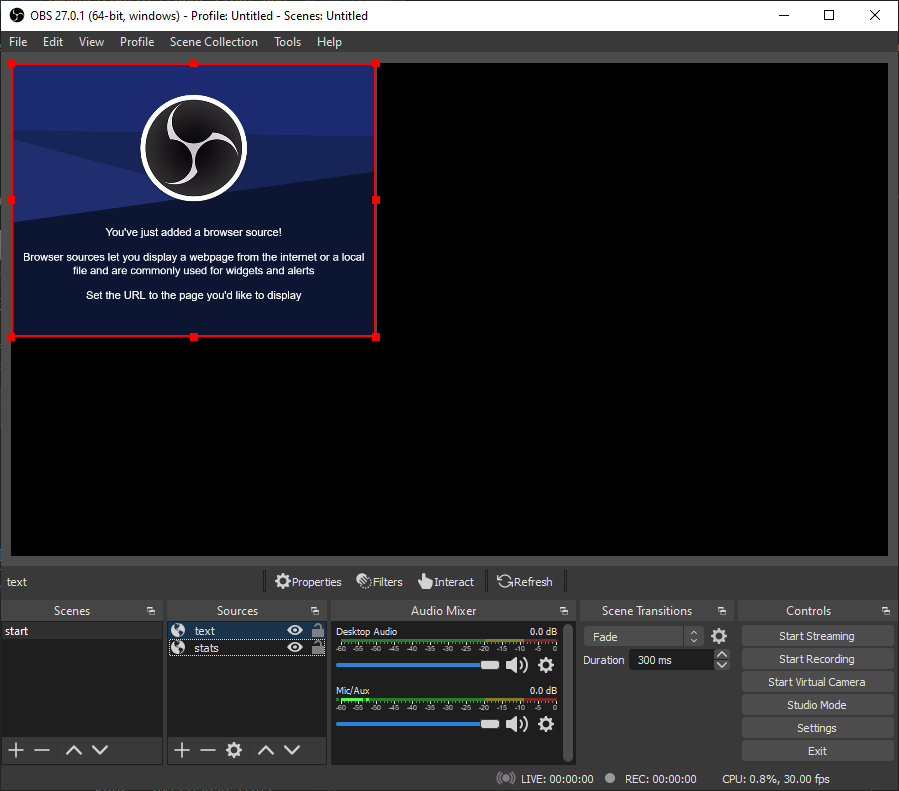
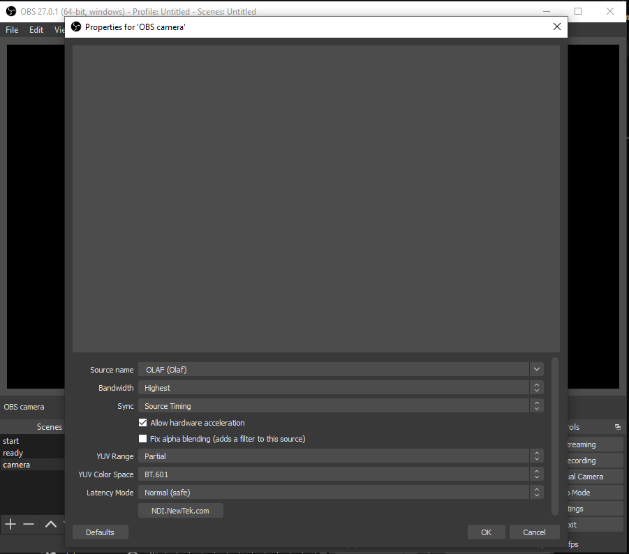
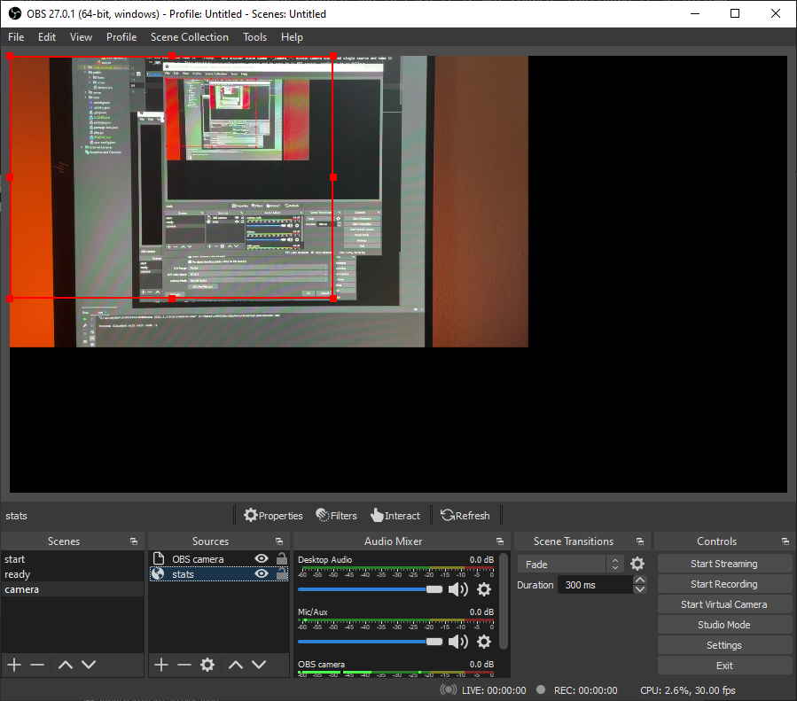
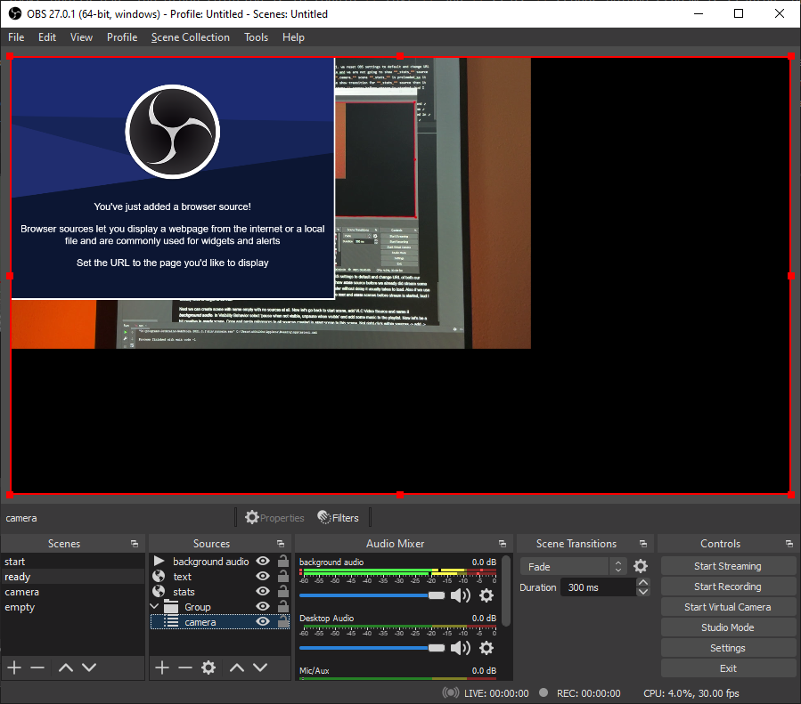
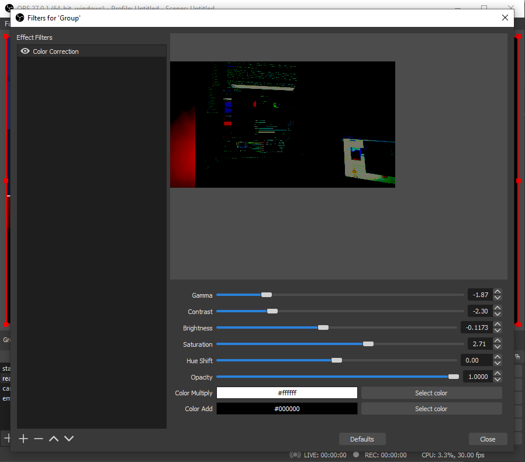

OBS Studio setup for StreamBalls
===========

OBS Studio doesn't work with StreamBalls out of the box, several plugins and some basic stuff must be configured first. Required plugins are [obs-websocket](https://obsproject.com/forum/resources/obs-websocket-remote-control-obs-studio-from-websockets.466/) to enable remote control and [obs-ndi](https://obsproject.com/forum/resources/obs-ndi-newtek-ndi™-integration-into-obs-studio.528/) to get low-latency and lossless stream of OBS main output. Several scenes and scene items should be present in OBS. You can just install required plugins and copy [obs-studio](config/obs-studio) settings directory from this project to your _%appdata%_ to have OBS preconfigured, however all configuration details shall be discussed in following sections.

Minimal OBS configuration has two scenes **_start_** and **_ready_** both with two browser sources **_text_** and **_stats_**. Then there has to be **_OBS camera_** source somewhere (with optional audio input), that represents main camera, and **_background audio_** VLC source. The typical use-case of StreamBalls application is as follows:

1. before stream is started new event (or match) with description (competition name etc.) is created and OBS settings is reset to default state. At this point **_text_** and **_stats_** browser sources get correct URL, scene is switched to **_start_**,  **_text_** source becomes visible and **_stats_** source is hidden. Streaming and recording (if active) is stopped, audio volume of both **_OBS camera_** and **_background audio_** sources is set to 0.
2. streaming key is set (if not set already)
3. streaming and / or recording is started
4. **_background audio_** is started and it's volume slowly fades-in
5. scene is changed to **_ready_**, where **_OBS camera_** can be already somehow visible, **_text_** is still visible and **_background audio_** is running
6. audio crossfade from **_background audio_** to **_OBS camera_** is triggered
7. scene is changed, **_OBS camera_** is fully visible
8. during live stream match events can be entered using keyboard shortcuts
9. at the end of the stream scene is switched to **_ready_**, match statistics can be displayed and volume can crossfade back to **_background audio_**

I'm sure you get the idea now. The point here is to be able to manipulate content of **_text_** and **_stats_** sources, toggle their visibility on scenes, where these sources are present, and to be able to crossfade volume between **_background audio_** and **_OBS camera_**. You are completely free to create own scene configuration with various custom sources, your creativity shouldn't be limited by described use-case. In case you want to pre-configure transitions for specific switches between scenes, I recommend taking a look at [obs-transition-matrix](https://obsproject.com/forum/resources/obs-transition-matrix.751/) plugin. 

## OBS installation

Download and install [OBS studio](https://obsproject.com) and [VLC](https://www.videolan.org) (for VLC Video Source), then [obs-websocket](https://github.com/Palakis/obs-websocket/releases) and [obs-ndi](https://github.com/Palakis/obs-ndi/releases) plugins. Now start OBS studio. When asked for obs-websocket server password, use _soboss_. You can change settings for both plugins later on in Tools -> <plugin_name>, but if you want to use different password, you'll have to change it also in [control.jsx](../imports/ui/obs-remote/control.jsx). Make sure that there is inbound rule to allow OBS executable accept connections in [firewall](http://lexisnexis.custhelp.com/app/answers/answer_view/a_id/1081611/~/adding-exceptions-to-the-windows-firewall) and make sure that the same applies for nodejs executable (%ProgramFiles%\nodejs\node.exe). Now you can either continue reading to set things manually or you can just copy [obs-studio](config/obs-studio) settings directory to your _%appdata%_ to have minimal requirements pre-configured.  

## Scene configuration

First rename default **_Scene_** to **_start_** by right-click -> rename. Within sources right-click -> add -> Browser, name it **_text_** and confirm default settings. Create one more Browser source the same way and name it **_stats_**. 

Now add scene and name it **_ready_** and another scene named **_camera_**. Within **_camera_** scene add single source and name it **_OBS camera_**. This should be your main camera source and in case it is NDI source, configure it as follows

Go to **_start_** scene, right-click on **_stats_** source -> copy and then go back to **_camera_** scene, right-click within sources -> paste (Reference). In **_camera_** scene make the **_stats_** source the last one in the list like this

To explain what we've done I need to review our use-case once again. In step 1. we reset OBS settings to default and change URL of both our browser sources. Browser sources are refreshed only when visible and we are not going to show **_stats_** source before we already streamed out some content in **_camera_** scene. While in **_camera_** scene **_stats_** is preloaded so it can be displayed later without delay it usually takes to load. Also if we use show transition for **_stats_** source then it usually looks pretty bad. The other solution is to toggle **_text_** and **_stats_** scenes before stream is started, bud I usually tend to forget to do that.

Now let's go back to start scene, add VLC Video Source and name it **_background audio_**. In Visibility Behavior select 'pause when not visible, unpause when visible' and add some music to the playlist. Now let's be a bit creative in **_ready_** scene. Copy and paste references to all sources created in **_start_** scene to this one. Now right-click within sources -> add -> Group (with some random name), right-click within sources -> add -> scene and add camera scene here. Drag and drop camera scene to new group like this

Now right-click Group -> Filters, add color correction filter and change some random values

It's nice to have some show / hide transitions on browser sources. Go to **_start_** scene and do the following
- right-click browser source **_text_** and set show transition to Slide Down
- right-click browser source **_text_** and set hide transition to Fade
- right-click browser source **_stats_** and set show transition to Fade
- right-click browser source **_stats_** and set hide transition to Slide Down

Now repeat the same thing in **_ready_** scene.

The last thing is to mute and hide **_Desktop audio_** in audio mixer. Generally we don't want to mix in desktop audio, because we are going to play the output audio in browser on the same PC where OBS is already running, so output would be nothing but mess.

## OBS configuration

Once you are done with scene configuration you might want to disable preview by right-clicking preview screen and unchecking _enable preview_, so that we save some CPU power. Now go to settings -> Video and make sure Output (scaled) resolution is 1280x720 for now. In Stream select your stream service and server, streaming key can be left blank. Also you can configure Recording and Stream encoder in Output now to fit your needs. Once done open tools -> NDI output settings and check _Main Output_ with the name _OBS_ (default). This makes OBS output accessible via NDI. Please note, that when you want to change any output settings again, this output in NDI plugin must be disabled.
